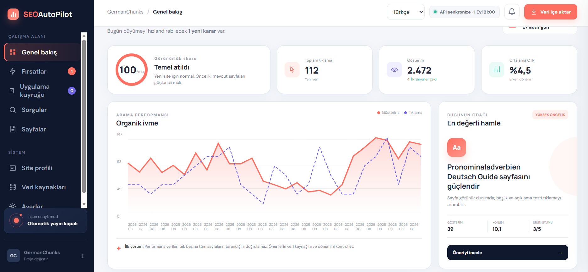
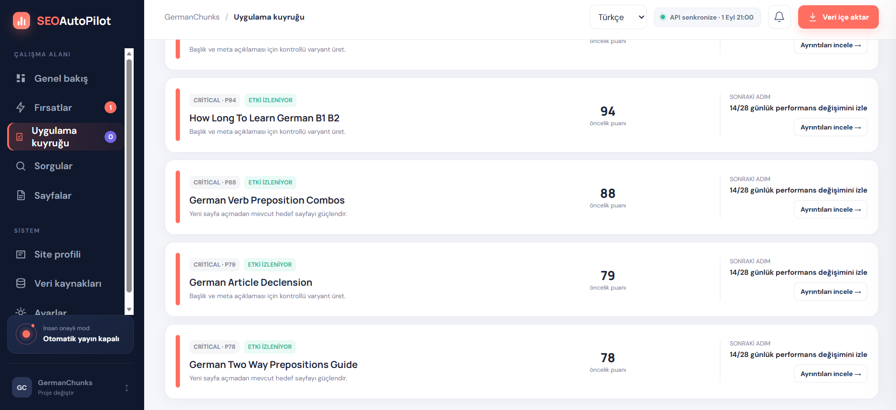
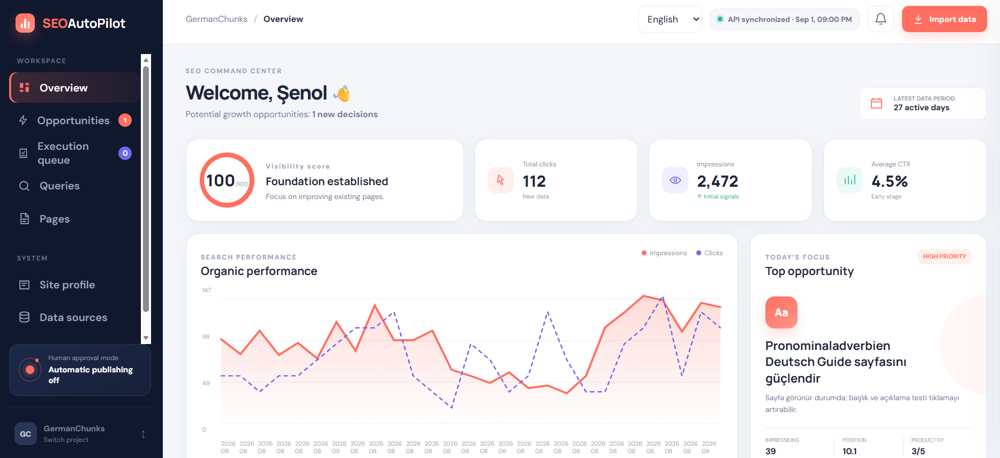

# SEOAutoPilot

[](https://github.com/Aristotheles/SEOAutoPilot/actions/workflows/ci.yml)
[](https://github.com/Aristotheles/SEOAutoPilot/actions/workflows/codeql.yml)
[](LICENSE)

<p align="center">
  <strong>Search Console sinyallerini güvenilir ve uygulanabilir SEO kararlarına dönüştür.</strong><br>
  <em>Turn Search Console signals into SEO decisions you can understand, approve and ship.</em>
</p>

<p align="center">
  <a href="#türkçe">Türkçe</a> ·
  <a href="#english">English</a> ·
  <a href="https://github.com/Aristotheles/SEOAutoPilot/releases/latest">Son sürüm / Latest release</a> ·
  <a href="https://github.com/Aristotheles/SEOAutoPilot/issues">Geri bildirim / Feedback</a>
</p>

## Türkçe

**SEOAutoPilot, ham SEO verisini yapılacaklar kalabalığına değil, denetlenebilir bir
karar sürecine dönüştürür.** Google Search Console verilerini sitenin dili, hedefi,
mevcut sayfaları ve proje bağlantılarıyla birlikte değerlendirir; fırsatları
önceliklendirir, önerinin gerekçesini gösterir ve yalnız sen onayladıktan sonra
uygulanabilir değişiklikleri bağlı siteye taşır.

Birden fazla projeyi birbirinden izole yönetebilir, Türkçe/İngilizce/Almanca
arayüzü kullanabilir, toplu yayın öncesinde değişecek alanları tek ekranda görebilir
ve yayın sonrasındaki 14/28 günlük etki dönemini takip edebilirsin. Veriler ve OAuth
bilgileri yerel kalır; SEOAutoPilot gizli anahtarlarını kaynak koda taşımaz.

> **SEO sihirli bir düğme değildir. SEOAutoPilot da öyle davranmaz:** veriyi açıklar,
> belirsizliği gösterir, geri dönüşü zor kararları insana bırakır ve yapılan işlemin
> kaydını tutar.

## English

**SEOAutoPilot turns raw SEO data into an auditable decision workflow—not another
overwhelming list of generic recommendations.** It evaluates Google Search Console
signals in the context of each site's language, goals, existing pages and deployment
connection; then ranks opportunities, explains the evidence and prepares controlled
changes that move forward only with human approval.

Run multiple isolated projects, use the Turkish/English/German interface, review an
exact batch before publishing, and follow the 14/28-day impact window after a release.
Project data and OAuth credentials stay local, while secrets remain outside the
repository and published site.

> **SEO is not a magic button, and SEOAutoPilot does not pretend otherwise:** it makes
> the evidence visible, marks uncertainty, keeps consequential decisions human and
> leaves a traceable record of what changed.

> **Durum:** Aktif MVP (`0.12.x`). Windows üzerinde doğrulanır; Node.js 22+ bulunan
> macOS/Linux sistemlerinde temel analiz ve arayüz çalışır. Firebase yayın adaptörünün
> ana test platformu Windows'tur.

Birden fazla site için proje bazlı, insan onaylı Search Console fırsat motoru.

## Ürün turu · Product tour

### 1. Karar odaklı genel bakış · Decision-first overview



Genel bakış, Search Console dönemindeki tıklama, gösterim ve CTR değerlerini tek
başına “iyi/kötü” diye etiketlemek yerine bağlamıyla gösterir. Organik performans
grafiği eğilimi görünür kılarken **Bugünün odağı**, en güçlü uygulanabilir fırsatı;
gösterim, ortalama konum ve ürün uyumu kanıtlarıyla birlikte öne çıkarır. Üst
çubuktaki senkronizasyon rozeti kullanılan verinin tarih ve saatini açıkça belirtir.

The overview keeps clicks, impressions and CTR in context instead of reducing SEO
to a vanity score. The organic-performance chart exposes the trend, while
**Today's focus** surfaces the strongest actionable opportunity with its supporting
impressions, average position and product-fit signals. The synchronization badge
makes the age of the underlying data explicit.

### 2. Şeffaf uygulama ve izleme kuyruğu · Transparent execution and monitoring



Her kart; öncelik puanını, önerinin türünü, mevcut durumunu ve sıradaki gerçek adımı
aynı yerde gösterir. `Etki izleniyor` durumundaki işler yeniden yayımlanmaz: sistem
yayından sonraki 14 ve 28 günlük karşılaştırma dönemini bekler. Ayrıntı ekranı,
önerilen alanları ve kararın dayanağını gösterir; toplu yayın yalnız uygun ve
değişmez öneri listesi kullanıcı tarafından açıkça onaylandıktan sonra başlar.

Each card keeps the priority score, recommendation type, current state and next
real action together. Items marked as being monitored are not published again:
the system waits for the 14- and 28-day post-release comparison windows. Detail
views expose the proposed fields and evidence, while batch publishing starts only
after the user explicitly approves an eligible, immutable change set.

### 3. Çok dilli arayüz, değişmeyen kaynak veri · Localized UI, untouched source data



Arayüz Türkçe, İngilizce ve Almanca arasında değiştirilebilir. Dil seçimi menüleri,
kontrolleri ve sistem açıklamalarını çevirir; Search Console sorgularını, gerçek sayfa
başlıklarını veya SEO taslaklarını gizlice tercüme etmez. Bu nedenle İngilizce arayüzde
başka dilde bir hedef sayfa ya da öneri görmek bilinçli ve denetlenebilir davranıştır.

The interface can switch between Turkish, English and German. This localizes menus,
controls and system guidance without silently translating Search Console queries,
real page titles or SEO drafts. Seeing a target page or recommendation in another
language inside the English UI is therefore intentional, traceable behavior—not
content corruption.

### Temel yetenekler · Core capabilities

- Birbirinden izole çoklu site ve hesap bağlantıları · Isolated multi-site and account connections
- Search Console API veya CSV dışa aktarımı · Search Console API or CSV exports
- Kanıta dayalı fırsat puanlama ve `HOLD` kararları · Evidence-based scoring and `HOLD` decisions
- Kaynak sayfa, canonical ve içerik dili doğrulaması · Source page, canonical and content-language verification
- Kesin değişiklikleri gösteren insan onay kapısı · Human approval gate with exact proposed changes
- Güvenli, sıralı toplu yayın ve ilk hatada durma · Safe sequential batch publishing with stop-on-first-failure
- Yayın sonrasında 14/28 günlük etki takibi · 14/28-day post-release impact monitoring
- Yerel gizli bilgi saklama ve proje bazlı Firebase seçimi · Local secret storage and project-scoped Firebase selection

Ürünün kapsamı, güvenlik sınırları ve kapanış ölçütleri için
[`docs/MVP-SPEC.md`](docs/MVP-SPEC.md) belgesi esas alınır.

## Arayüz

Sol menüde **Ayarlar**: Türkçe/English/Deutsch arayüz dili, büyük yazı,
azaltılmış animasyon ve açılışta otomatik senkronizasyon tercihleri.
Dil üst çubuktan da değiştirilebilir. Tercihler yalnız bu tarayıcıdaki
`seo-ui-settings` kaydında saklanır; proje içerik dillerini etkilemez.
Sıfırlama yalnız bu tercihleri değiştirir, proje/anahtar/rapor silmez.
Menüler, ortak kontrol etiketleri ve Ayarlar ekranı çevrilir. Kaynak raporlar,
SEO metinleri, işlem geçmişi ve ham sunucu hata mesajları özgün dilinde korunur.

Uygulamayı başlat:

```powershell
npm start
```

İlk kurulum:

```powershell
git clone https://github.com/Aristotheles/SEOAutoPilot.git
cd SEOAutoPilot
npm run verify
npm start
```

Windows kullanıcıları `scripts/start-windows.cmd` dosyasını da çalıştırabilir.

> [!CAUTION]
> **Eski tek dosyalı Windows EXE geri çekildi.** `v0.11.2` ikili dosyası Microsoft
> Defender tarafından `Trojan:Win32/Wacatac.B!ml` olarak karantinaya alındığı için
> çalıştırılmadan yayından kaldırıldı. Defender istisnası eklemeyin ve dosyayı
> karantinadan geri yüklemeyin. `v0.12.0` ile `pkg` tabanlı tek EXE paketlemesi
> kaldırıldı; masaüstü sürümü Tauri ve SHA-256 değeri sabitlenmiş resmi Node.js
> yardımcı programıyla standart MSI/NSIS paketi olarak derlenir. Paketler kod
> imzalama hattı tamamlanana kadar “Bilinmeyen yayıncı” uyarısı gösterebilir.

### Windows masaüstü paketini derleme

Windows 10/11, WebView2, Rust stable ve Visual Studio 2022 C++ Build Tools gerekir.
Derleme komutu resmi Node.js yardımcı programını `nodejs.org` üzerinden indirir,
sabit SHA-256 değeriyle doğrular ve yalnız yerel derleme klasörüne koyar:

```powershell
npm ci
npm run verify
npm run tauri:build
```

Çıktılar:

```text
src-tauri/target/release/bundle/msi/SEOAutoPilot_<sürüm>_x64_tr-TR.msi
src-tauri/target/release/bundle/nsis/SEOAutoPilot_<sürüm>_x64-setup.exe
```

Tauri kabuğu arayüzü WebView2 içinde açar. Node.js ayrı ve değiştirilmemiş bir
yardımcı süreçtir; uygulama penceresi normal kapatıldığında o da kapatılır. Yerel
proje verileri `%APPDATA%\com.aristotheles.seoautopilot` altında tutulur.

Ardından `http://127.0.0.1:4173` adresini aç. Rapor bağlanmamış projeler veri
bekliyor olarak gösterilir. Sağ üstteki **Veri içe aktar** düğmesiyle Search Console dışa aktarım
klasörünün tam yolunu girerek gerçek raporu analiz edebilirsin.

Arayüzde:

- görünürlük skoru ve temel performans göstergeleri,
- önceliklendirilmiş SEO fırsatları,
- sorgu kümeleri ve sayfa performansları,
- öneri gerekçesi, güven seviyesi ve insan onay kontrol listesi,
- masaüstü ve mobil uyumlu görünüm bulunur.

## Çok projeli kullanım

Sol alttaki proje seçiciden istediğin kadar site ekleyebilirsin. Her projenin:

- Search Console mülkü,
- CSV klasörü,
- API bağlantısı ve yenileme belirteci,
- son senkronize raporu ayrı saklanır.

Yerel proje verileri `data/*.json` içinde tutulur ve GitHub'a gönderilmez.

## Search Console API

**Veri kaynakları → API'yi kur** ekranı OAuth bilgilerini ve gerekli geri dönüş
adresini gösterir. Google Cloud Console'da Search Console API'yi etkinleştirip
**Web application** türünde bir OAuth istemcisi oluşturmalısın. Uygulama yalnızca
`https://www.googleapis.com/auth/webmasters.readonly` salt okunur kapsamını ister.

Yerel geri dönüş adresi:

```text
http://127.0.0.1:4173/oauth/google/callback
```

İstemci gizli anahtarı kaynak koduna veya GitHub'a yazılmaz.

Bağlı projeler uygulama açıldığında otomatik olarak senkronize edilir. Aynı
tarayıcı oturumundaki sayfa yenilemeleri gereksiz API çağrısı üretmez. Uygulama
Google hesabındaki yetkili Search Console mülklerini listeler ve proje alan
adıyla eşleşen Domain veya URL-prefix mülkünü kendisi seçer. Son başarılı
senkronizasyonun tarih ve saati üst durum rozetinde ve veri kaynağı kartında
gösterilir.

## Kontrollü otomasyon

### Toplu canlı yayın — 0.10.0

Onay kuyruğundaki **Tüm uygun önerileri canlıya yayınla** düğmesi, seçili projenin
uygun önerilerini ve kesin değişikliklerini tek onay penceresinde gösterir. Bu tek
onay hem değişiklikleri hem canlı yayını kapsar; görev ayrıntılarına tek tek girmek
gerekmez. Başlık/meta/H1 alanları uygulanır. Dil/profil engelleri, yeni sayfalar,
CTR varyant seçimi ve aynı hedefe ikinci öneriler toplu kapsama girmez. İncelenen
liste değişirse onay reddedilir.

Her sayfa güncel kaynak dalından sırayla hazırlanıp ayrı yayınlanır; tek Firebase
deploy değildir. İlk hatada kuyruk durur; önceki başarılı yayınlar geri alınmaz.
Her başarılı sayfada **İncele** bağlantısı gösterilir. İşlem sürerken değişiklik
uçları kilitlidir. Kuyruk proje verisinde saklanır. Sunucu kapanırsa belirsiz yayın
otomatik tekrar edilmez; sonuç kontrolü gerekir. Diğer projeler topluca yayınlanmaz.

Firebase önizleme kanalına ayrı yayın yapılmaz. Akış: değişiklikleri onayla →
ayrı çalışma alanında hazırla ve derlemeyi doğrula → açık canlı yayın onayı →
Firebase Hosting'e yayınla → Yeni sayfayı gör. Yayın hatası sonrası hazırlanmış
çalışma alanı korunur; tekrar Firebase önizlemesi gerekmez. Eski önizleme
kayıtlarıyla yayın uyumluluğu korunur. Derleme ve hedef proje kontrolleri sürer.

Her analizden sonra fırsatlar otomatik olarak kalıcı iş akışlarına çevrilir:

1. Sinyal ve arama niyeti doğrulanır.
2. Etki, veri güveni ve ürün uyumundan 0–100 öncelik puanı hesaplanır.
3. Uygulama brifi ve sonraki adımlar hazırlanır.
4. Siteye etki edecek değişiklik kullanıcı onayına sunulur.
5. Onaylanan görev uygulama kuyruğuna alınır.
6. Uygulama sonrasında 14 ve 28 günlük izleme dönemi başlatılır.

Analiz, puanlama, brief ve izleme otomatik olabilir. İçerik yayınlama, mevcut
sayfayı değiştirme, yönlendirme ve silme işlemleri kullanıcı onayı olmadan
çalıştırılmaz.

Analiz motoru mevcut Search Console CSV dışa aktarımlarını okuyarak:

- sorguları ürünle ilişkili kümelere ayırır,
- veri güven seviyesini hesaplar,
- mevcut sayfayı geliştirme ile yeni sayfa açmayı ayırır,
- yetersiz veride `HOLD` kararı verir,
- JSON formatında denetlenebilir bir rapor üretir.

Arka planda sessiz yayın bu sürümün kapsamında değildir. Tekil akışta taslak
onayı yalnız hazırlık izni verir; canlı yayın ayrıca onaylanır. Toplu akışta ise
son ekranda gösterilen kesin sayfalar ve alan değerleri için verilen açık onay,
yalnız o değişmez listeyi sırayla canlıya yayınlama iznidir. Liste değişirse onay
jetonu geçersiz olur; ilk hatada kalan sıra durur ve önceki başarılar otomatik
geri alınmaz.

## Gereksinim

- Node.js 22 veya üzeri

Harici paket gerektirmez.

Git/Firebase üzerinden yayın yapacaksan ayrıca Git ve Firebase CLI gerekir. Yalnız analiz,
CSV içe aktarma ve Search Console API kullanımı için Firebase CLI gerekmez.

Yeni kurulum boş bir proje listesiyle açılır; LingoDecoder veya başka bir marka
otomatik eklenmez. Her site kullanıcı tarafından oluşturulur. Eski kurulumdan
taşınan LingoDecoder kaydı legacy analiz paketini koruyabilir, yeni projeler
generic motorla başlar.

## Site kaynak bağlantıları

Her projenin Git/Firebase bağlantısı bağımsızdır. Vite projelerinde statik SEO
sayfaları `public/` içinden düzenlenir; izole Git çalışma kopyasında `npm ci`
ve `npm run build` çalıştırılır. `package-lock.json` kaynak depoda bulunmalı
ve temiz kurulumla uyumlu olmalıdır. Firebase Hosting'in yayın klasörü
`firebase.json` dosyasından okunur (standart Vite projesinde `dist/`).
Özel Vite `root`/`publicDir` yapılandırmaları bu adaptörün kapsamında değildir.

Hedef URL'nin `.html` uzantısı korunur. Derlenen hedef sayfa kaynak dosyayla
eşleşmeden önizleme yayınlanmaz. LingoDecoder'ın Flutter release betiği ayrı
adaptör üzerinden çalışmaya devam eder.

Yalnız yerel Git deposu olan projeler önizleme hazırlayabilir; canlı yayın
için ayrıca `origin` uzak deposu ve kullanıcının yayın onayı gerekir.
Bağlantıyı kaydetmek siteyi yayınlamaz. Gizli anahtarlar ve özel kullanıcı
verileri Git'e veya yayın klasörüne eklenmemelidir.

Firebase hesabı her proje için otomatik seçilir: CLI'de kayıtlı hesapların
ilgili proje ve Hosting sitesine erişimi sorgulanır. Eksik hesap bir kez
`firebase login:add eposta` ile eklenir; Search Console OAuth bağlantısından
bağımsızdır. Seçilen e-posta projede saklanır; tokenlar SEOAutoPilot'a kopyalanmaz.
Arayüz hesap ve kontrol zamanını gösterir. Erişim doğrulanamazsa önizleme ve
yayın kapalıdır; yeni bağlantı doğrulanmadan kaydedilmez.

Önizleme/yayın öncesinde erişim yeniden kontrol edilir ve Firebase komutlarına
açık `--account` verilir. Flutter release betiğinin iç komutları yalnız izole
çalışma kopyasında seçilen hesabı kullanır; global varsayılan hesap değiştirilmez.
Bu kontrol Hosting erişimini doğrular, tüm yayın/IAM izinlerinin garantisi
değildir; ek izinler Firebase tarafından yayın sırasında kontrol edilir.

## Bağlantı ve proje kaldırma

Veri kaynakları → Bağlantıları yönet / kaldır bölümünde:

- **Site bağlantısını kaldır:** Seçili projenin Git/Firebase eşleştirmesini keser,
  önceki önizlemenin yayın yetkisini iptal eder. Kaynak klasörü, GitHub, Firebase
  sitesi ve önizleme dosyaları silinmez. Aktif yayın/derleme bitmeden kullanılamaz.
- **Google bağlantısını kes:** Yalnız seçili projenin yerel tokenlarını siler.
  Devam eden OAuth/senkronizasyon istekleri bağlantıyı geri getiremez.
- **Ortak Google OAuth bilgilerini sil:** TÜM projelerin yerel tokenlarını ve
  kayıtlı OAuth bilgilerini kaldırır. Ortam değişkenlerinden gelen yapılandırmayı
  da bu uygulamada kalıcı olarak devre dışı bırakır; yeniden kurulum gerekir.
- **Projeyi kaldır:** Adını yazarak onayladıktan sonra uygulamadaki proje kaydı,
  raporları, görevleri ve tokenları kalıcı silinir. Gerçek site, kullanıcı kaynak
  dosyaları ve diğer projeler korunur. Projeler listesinden de kullanılabilir.

Bu işlemler Google Cloud'daki API/istemciyi silmez ve Google hesabındaki uygulama
iznini iptal etmez. Bunun için Google hesap bağlantıları/Cloud Console kullanılmalıdır.
Kaldırma uçları DELETE isteği ve hedefe özel açık onay gerektirir.

## Otomatik testler

```powershell
npm test
```

Testlerle birlikte Git'e izlenen dosyalarda bilinen anahtar/token imzalarını
taramak için:

```powershell
npm run verify
```

`data/`, OAuth yapılandırması, raporlar, yedekler ve geçici çalışma kopyaları
Git dışında tutulur. API yanıtları refresh token veya OAuth client secret içermez.

## Search Console dışa aktarımını analiz etme

```powershell
npm run analyze -- "C:\path\to\Search-Console-export"
```

CSV klasöründe Search Console'un Türkçe, İngilizce veya Almanca dosya adları
tanınır (`Grafik/Chart/Diagramm`, `Sorgular/Queries/Suchanfragen`,
`Sayfa sayısı/Pages/Seiten` ve eşlik eden cihaz/ülke dosyaları).

Raporu dosyaya yazmak için:

```powershell
npm run analyze -- "C:\path\to\Search-Console-export" `
  --output reports\latest.json
```

`reports/*.json` Git'e alınmaz; Search Console verisi özel kalır.

## Site profili — 0.7.0

### Otomatik inceleme — 0.8.0

**Siteyi otomatik incele → özeti kontrol et → Bu bilgilerle devam et.**
Teknik form kapalı Gelişmiş ayarlar bölümüne taşındı. İnceleme aynı HTTPS alan
adındaki HTML sayfalarını, sitemap dosyalarını, dil bildirimlerini, alternatif
dil bağlantılarını ve stil dosyası bağlantılarını okur. İlk tarama en fazla
40 adres/60 saniye ile sınırlıdır; tüm site taranmış sayılmaz. Özel ağlara ve
başka alan adlarına yönlendirmeler engellenir. Google tokenı gönderilmez.

JavaScript çalıştırılmaz; görülen dil sunucu HTML bildiriminin kanıtıdır,
gerçek metnin dilinin veya Googlebot görünümünün garantisi değildir. Ana dil
belirsizse tek seçim sorulur. Ziyaretçi açılış kuralları tahmin edilmez ve
mevcut tercihler değiştirilmez. İnceleme kendi başına profil kaydetmez.
Kullanıcı onayı sonrası yalnız doğrulanan adreslere otomatik taslak izni verilir.
İnceleme özeti sunucu yeniden başlatılana kadar tutulur; onaylanan eşleştirmeler
proje profilinde kalıcıdır. Yeni inceleme eski dil tercihlerini silmez.

**Site profili** ekranından her projenin içerik dillerini, ana dilini, ilk ziyaret
varsayılanını, açılış tercihini, hedef pazarlarını ve marka bilgilerini kaydet.
Bir yazının bütün dillere çevrilmesi zorunlu değildir. İngilizce varsayılan açılış,
bütün yazıların İngilizce olduğu anlamına gelmez. Dili belirsiz veya kuralları
çelişen sayfalarda taslak onayı ve yayın durur; URL–dil eşleştirmesi gerekir.

Profil kullanıcı tarafından doğrulanmadan yeni yayın işlemleri kapalıdır. Profil
değişince henüz uygulanmamış önerilerin onayı/önizleme yetkisi sıfırlanır. Yayın
geçmişi korunur; yayın sırasında profil değiştirilemez. Eşzamanlı eski form
kayıtları sürüm kontrolüyle reddedilir.

Yeni projelerde Almanca eğitim veya belirli marka varsayımı yoktur. Mevcut
LingoDecoder içerik planı ve eski konu eşleştirmeleri yalnız o projenin geçiş
profilinde korunur; kullanıcı konu eşleştirmelerini kapatabilir. Taslaklar
kural tabanlı başlangıç önerileridir, kaynak sayfa doğrulaması veya AI analizi
değildir. Taslak desteği şimdilik Türkçe, İngilizce ve Almancadır; diğer diller
kaydedilebilir ama sessizce İngilizce taslak üretilmez.

İlk veri okumasında eski proje dosyasının birebir yedeği `data/backups/` içine
alınır ve şema 2'ye geçilir. Tokenlar, bağlantılar, raporlar ve görev geçmişi
korunur. Yedekler özel veri içerir; Git'e alınmaz. Bozuk dosya sıfırlanmaz.

Bu aşama yalnız SEOAutoPilot ayarlarını değiştirir. Bağlı sitelerde dil seçimi,
yönlendirme, tasarım veya içerik değişikliği yapmaz; Googlebot'un hangi dili
gördüğünü doğruladığı iddia edilmez.

## Sıradaki aşamalar

1. Kaynak/canlı URL envanteri: gerçek dil, karşılık sayfalar, canonical,
   hreflang, sitemap ve yönlendirme kontrolü; otomatik dil keşfi.
2. Sayfa dili ile ziyaretçi ülkesini ayıran Search Console analizi; yeterli
   kanıt yoksa öneriyi bekletme.
3. Projenin mevcut tasarımına uyan değişiklik farkı ve önizleme doğrulaması;
   kaynak değişiklikleri ve canlı yayın için ayrı kullanıcı onayı.
4. Yayın sonrası gerçek verilerle etki takibi; mevcut LingoDecoder içerik
   iyileştirme kuyruğunu koruma.

## Güvenlik ve katkı

- Güvenlik modeli ve özel bildirim süreci: [`docs/SECURITY.md`](docs/SECURITY.md)
- Katkı rehberi: [`CONTRIBUTING.md`](CONTRIBUTING.md)
- Destek sınırları: [`SUPPORT.md`](SUPPORT.md)
- Davranış kuralları: [`CODE_OF_CONDUCT.md`](CODE_OF_CONDUCT.md)

Güvenlik açığını herkese açık issue olarak paylaşma. Hassas bilgi içermeyen hatalar ve
özellik önerileri için GitHub issue şablonlarını kullan.

## Topluluk ve destek · Community & support

SEOAutoPilot bağımsız geliştirilen, reklamsız ve açık kaynaklı bir projedir. İşini
kolaylaştırıyorsa yıldız vererek, geri bildirim göndererek, katkıda bulunarak veya
geliştirme çalışmalarını destekleyerek projenin sürdürülebilirliğine yardımcı
olabilirsin.

SEOAutoPilot is independently built, ad-free and open source. If it saves you time,
you can help keep it moving by starring the repository, sharing feedback,
contributing code or supporting continued development.

<p align="center">
  <a href="https://patreon.com/opensource2"></a>
  <a href="https://x.com/VibeKodlama"></a>
  <a href="https://github.com/Aristotheles"></a>
</p>

**Bitcoin (BTC · BlueWallet):**
`bc1q7kpfdc9stpnexvwgpzxl8nzaua8wfyp2ht8xxa`

Diğer üretimler ve kanallar · More projects and channels:

- [Breath of Rumi — YouTube](https://www.youtube.com/@BreathofRumi)
- [Kalpten Nağme — YouTube](https://www.youtube.com/@KalptenNa%C4%9Fme)
- [GermanChunks Official — Instagram](https://instagram.com/germanchunksofficial)
- [Kalpten Nağme — Instagram](https://instagram.com/kalptennagme)

## Lisans

SEOAutoPilot, [GNU Affero General Public License v3.0](LICENSE) ile yayımlanır.
Değiştirilmiş bir sürümü ağ üzerinden kullanıcıların hizmetine sunarsan ilgili kaynak
kodunu da AGPL-3.0 koşullarıyla erişilebilir kılman gerekir.
